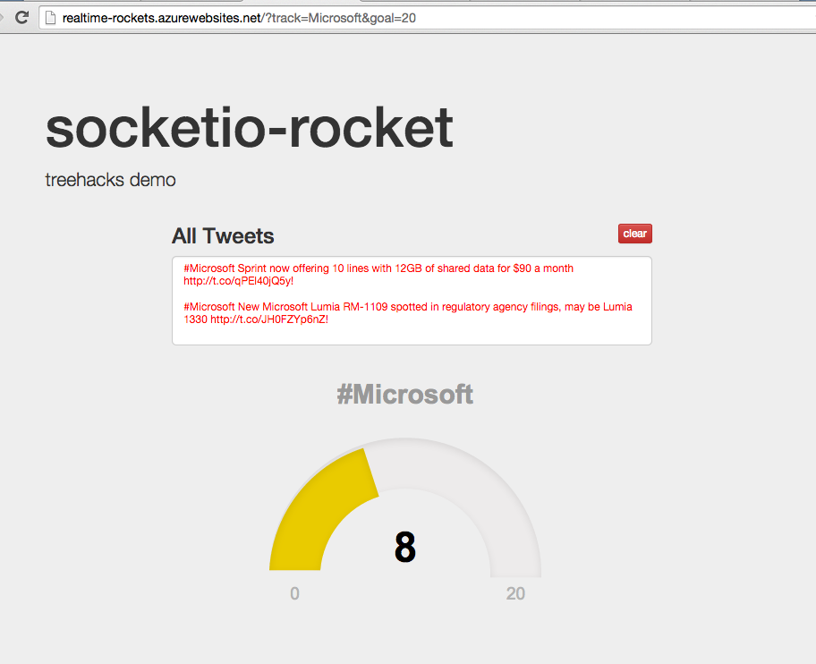
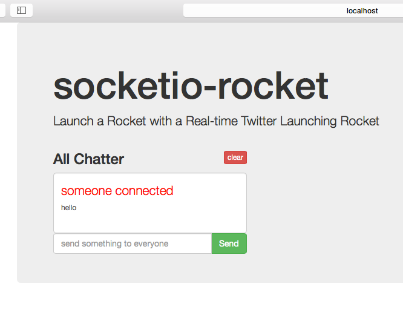
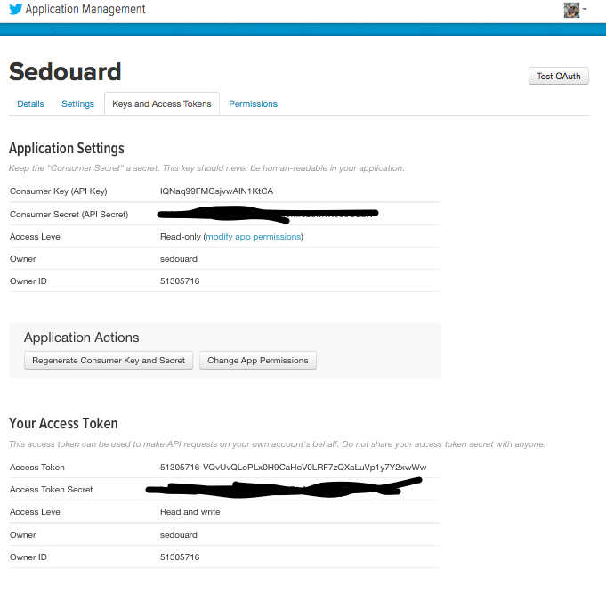

# Realtime Rockets Via Node.js



## Objectives

By the end of this walk-through you'll be able to:
- Use [Yeoman](Yeoman.io) to create a socket.io application with [Express](http://expressjs.com) and [Bootstrap](http://getboostrap.com)
- Create a 'Gauge' using the [Gage](http://gagejs.com)
- Send Live Tweets and Count from Server to front-end
- Send a Signal to Launch a Rocket!

## Introduction

In this walk-through we'll use the [Yeoman](Yeoman.io) [socket.io generator](https://www.npmjs.com/package/generator-socketio) to generate to create a boiler plate real-time application. We'll then modify the application to have some basic styling with bootstrap.

Afterwards we'll us the [Twit](https://www.npmjs.com/package/twit) client library to stream tweets on a hashtag and stream those down to our web page real-time.

## Getting Started

### Install Nodejs

Go ahead and install [nodejs](http://nodejs.org).

### Install Yeoman and the Generator

Afterwards go to your command line and execute:

```bash
# installs yeoman
npm install yeoman -g
# installs the generator
npm install generator-socketio -g
# installs bower
npm install bower -g
```

### Creating the Application Scaffold

Now create the boilerplate application:

```bash
yo socketio
```

Afterwards just answer the questions Yeoman asks:

```bash
     _-----_
    |       |
    |--(o)--|   .--------------------------.
   `---------´  |    Welcome to Yeoman,    |
    ( _´U`_ )   |   ladies and gentlemen!  |
    /___A___\   '__________________________'
     |  ~  |
   __'.___.'__
 ´   `  |° ´ Y `

[?] What do you want to call this project? socketio-rocket
[?] Write a brief description. Launch a Rocket with a Real-time Twitter Launching Rocket
[?] What port number would you like to run on? 3000
socketio-rocket - Launch a Rocket with a Real-time Twitter Launching Rocket
to run on port - 3000
[?] Do you want to use Bootstrap? Yes
true
[?] In what format would you like the Bootstrap stylesheets? less
less
   create server.js
   create views/index.ejs
   create public/js/app.js
   create Gruntfile.js
   create package.json
   create bower.json
   create .editorconfig
   create .jshintrc
   create .bowerrc
   create .gitignore

```

Afterwards yeoman generates a sample real-time chat application. Run the app by executing:

```
grunt
Running "less:production" (less) task
File public/css/core.css created.

Running "concat:dist" (concat) task
File "public/js/concat.js" created.

Running "uglify:my_target" (uglify) task
File "public/js/app.min.js" created.

Running "concurrent:target" (concurrent) task
Running "watch" task
Running "nodemon:dev" (nodemon) task
Running "wait:pause" (wait) task
Waiting...pausing 1000ms before launching page
Start waiting 1000ms
20 Feb 11:59:24 - [nodemon] v0.7.10
20 Feb 11:59:24 - [nodemon] to restart at any time, enter `rs`
20 Feb 11:59:24 - [nodemon] watching: /Users/user/Documents/socketio-demo/Start/views
20 Feb 11:59:24 - [nodemon] watching: /Users/user/Documents/socketio-demo/Start/routes
20 Feb 11:59:24 - [nodemon] reading ignore list
20 Feb 11:59:24 - [nodemon] starting `node server.js`
pause end, heading to page (using default browser)
>> Done waiting after 1003ms

Running "open:server" (open) task
```

Grunt will compile and minify your front-end code, start the server and point your default browser to it:




## Customizing the Front-End

Let's make the application look a bit more like what we want it to be. We'll replace '**All Chatter**' with **'All Tweets'** and we'll make the chat box centered rather than left justified. We'll also remove the 
**send a message** form input because we won't be needing any user input.

Change the file `Start/index.ejs` to reflect the changes in the container div:

```html
<div class="container">
    	<div class="jumbotron">
        	<h1>socketio-rocket</h1>
       		<p>treehacks demo</p>
       		<div class="row">
       			<div class="col-md-offset-2 col-md-8">
       				<h3>All Tweets<button id="clearAllPosts" type="button" class="btn btn-danger btn-xs pull-right">clear</button></h3>
       				<div id="allPosts" class="form-control"></div>
       			</div>

       		</div>
       		<div class="row">
       			<div id="track-gauge" class="col-md-offset-3 col-md-8" style="width:440px; height:320px">
       		</div>
       		
		</div>
	</div>
```

### Adding the gauge

Let's add our gauge we'll use to determine how far we are from the goal amount of tweets. Download [JustGage](http://justgage.com/) a simple gauge javascript library. It should come with two libraries raphael, a drawling library and just gage itself.

Find the file `justgage.1.0.1.min.js` and `justgage.1.0.1.min.js"` (the version numbers may change slightly in the future) and place it in `Start/public/js`. Now in your index.ejs, toward the bottom and above the import for `app.min.js` place a link to this file:

```html

<!-- socket.io -->
<script src="/socket.io/socket.io.js"></script>

<!-- JustGage gauge -->
<script src="js/raphael.2.1.0.min.js"></script>
<script src="js/justgage.1.0.1.min.js"></script>

<!-- APP CODE -->
<script src="js/app.min.js"></script>

```

Now we need a div for our gauge to live in. Lets place it in a div with the class `row`  which will place it below the twitter feed. Within it we'll place the actual gauge in a div with `id="track-gauge"`. Your container div should know look like this:

```html
<div class="container">
    	<div class="jumbotron">
        	<h1>socketio-rocket</h1>
       		<p>treehacks demo</p>
       		<div class="row">
       			<div class="col-md-offset-2 col-md-8">
       				<h3>All Tweets<button id="clearAllPosts" type="button" class="btn btn-danger btn-xs pull-right">clear</button></h3>
       				<div id="allPosts" class="form-control"></div>
       			</div>

       		</div>
       		<div class="row">
       			<div id="track-gauge" class="col-md-offset-3 col-md-8" style="width:440px; height:320px">
       		</div>
       		
		</div>
	</div>
```

Below your app code link let's add some in-line javascript. This code will use the JustGage library to initialize our gauge and draw it in the div. We're doing in-line js here because we'll be grabbing some *templating* data from the node server that the js code will use. Trust me this will make sense in the next section!

```html
<!-- socket.io -->
<script src="/socket.io/socket.io.js"></script>

<!-- JustGage gauge -->
<script src="js/justgage.1.0.1.min.js"></script>

<!-- APP CODE -->
<script src="js/app.min.js"></script>

<!-- Configure gauge with templating information-->
<script>
	var g = new JustGage({
	    id: "track-gauge",
	    value: 0,
	    min: 0,
	    max: <%=goal%>,
	    title: "#<%= track %>"
  	});
</script>
```

The `goal` and `track` variables are special ejs (embedded javascript) tempting variables that will come from our sever. This allows us to set the UI to track any hashtag for any number of goal tweets.

## Implementing the front-end logic

The front-end code is mostly implemented within `Start/public/js/app.js`. However we do need to do a couple things to get it to work with our server.

First after we connect to the server, we want to tell the real-time tracker which hashtag and what the goal amount is we are setup for. We'll use **socket.emit** which will use to emit a new event called **register**. In the next section on the backend, we'll listen to this message.

The **register** message has 2 values within it, `track` and `goal` which is the hashtag and the goal amount to trigger the rocket, respectively. This data will be retrieved from the [URL query parameters](http://en.wikipedia.org/wiki/Query_string).

```js
socket.emit("register", {track: getParameterByName('track'), goal: getParameterByName('goal')});

function getParameterByName(name)
{
	name = name.replace(/[\[]/, "\\\[").replace(/[\]]/, "\\\]");
	var regexString = "[\\?&]" + name + "=([^&#]*)";
	var regex = new RegExp(regexString);
	var found = regex.exec(window.location.search);
	if(found == null)
	  return "";
	else
	  return decodeURIComponent(found[1].replace(/\+/g, " "));
}
```
In the back-end this will trigger the twitter stream to turn on for the provided hashtag.

Finally the front-end is already listening for a message called `blast`. We'll reuse this message as we'll need it to display the live twitter updates.

However to update the gauge animation we'll have to call `refresh` on the gauge each time we get a new tweet. We'll add this line of code within the `blast` event handler in `app.js`:

```js
//update gauge with latest count data
g.refresh(data.count);
```

The entire blast handler should be:

```js
//SOCKET STUFF
	socket.on("blast", function(data){
		var copy = $allPostsTextArea.html();
		$allPostsTextArea.html('<p>' + copy + data.msg + "</p>");
		$allPostsTextArea.scrollTop($allPostsTextArea[0].scrollHeight - $allPostsTextArea.height());
		//.css('scrollTop', $allPostsTextArea.css('scrollHeight'));
		//update gauge with latest count data
		g.refresh(data.count);
	});
```
Thats it! We're now done with the front-end UI and logic.

## Implementing the Server

### Showing the Goal and Track Variables in the UI

If you remember from the previous section we placed two ejs (embedded javascript) variable within the index.ejs file. The server needs to provide those variables in order for the els to work. To do this we'll look inside `Start/server.js` and change the `app.get("/")` handler to:

```js
app.get("/", function(req, res){
	// check if we got the track and goal query parameters
	if(!req.query.track || !req.query.goal){
		return res.send(400);
	}
	
	res.render('index', {track: req.query.track, goal: req.query.goal});
});
```

This code will simply return an error (Bad Request) if the user doesn't open up the website with the query parameters `track` and `goal`. That is, if your host was `localhost:3000` then you must browse to for example, `localhost:3000/?track=Microsoft&goal=10` in order get to the app. Finally this line:

```js
res.render('index', {track: req.query.track, goal: req.query.goal});
```

Tells the Express server to render the index.ejs view with two template variables `goal` and `track` with the values from the query parameters. This will show the use what hashtag we are tracking and what the goal amount is.

### Streaming the Tweets From the Twitter

In order to read tweets from Twitter you'll need to create a new [Twitter application registration](http://apps.twitter.com). Create a new application. You don't need any special permissions and everything we're doing is just looking at  public tweets.

After you create your app you should be able to get to a `Keys and Access Tokens` tab:



Now navigate to the `Start` folder in your command line and execute:

```
npm install twit --save
```

The `--save` will save the dependency in your package.json which will become useful when we deploy the application.

Now add the `var Twit = require('twit')` to your `Start/server.js` file, and initialize it with the keys found on your twitter app registration:

```js
var Twit = require('twit');
/**
Either put your keys directly in here (bad idea)
var twitter = new Twit({
    consumer_key: "<Consumer Key>",
    consumer_secret: "<Consumer Secret>",
    access_token: "<Access Token>",
    access_token_secret: "<Access Token Secrete>"
});
**/
//place these keys in the following env variables (good idea)
var twitter = new Twit({
    consumer_key: process.env.TwitterConsumerKey,
    consumer_secret: process.env.TwitterConsumerSecret,
    access_token: process.env.TwitterAccessToken,
    access_token_secret: process.env.TwitterAccessTokenSecret
});
```

Now we're ready to stream tweets down to the client. Socket.io is automagically installed already and the code snippet `io.sockets.on('connection', function (socket)` is where the magic happens. 

The `io.sockets.on` registers a handler to a particular event for any socket connection that is incoming. This tells us that a client connected and we are handed a `socket` which is specific to that client. We'll register a handler to the `register` event that we wrote in app.js for the frond-end. This is what will tell us when the client is ready for the server to stream down tweets.

```js
io.sockets.on('connection', function (socket) {

	
	//register for track
    socket.on('register', function(data){
    	var stream = twitter.stream('statuses/filter', { track: "#" + data.track });
    	var count = 0;
	    stream.on('tweet', function (tweet) {
	    	count++;
	        socket.emit('blast', {msg:"<span style=\"color:red !important\">" + tweet.text + "!</span>", count: count});
	    });
```

The above snippet is incomplete. The last thing the register handler does in the snippet is open up the twitter stream for the hashtag specified by the message from the client. The twitter client is also an event emitter so we register a handler for it as well. Within it we keep count of how many tweets we've received and we send the tweet text and the current count we are at back down to the client. This is how the gauge can adjust itself and how the text box will get the live twitter stream.

Finally, our socket connection handler implementation looks like this:

```js

io.sockets.on('connection', function (socket) {

	
	//register for track
    socket.on('register', function(data){
    	var stream = twitter.stream('statuses/filter', { track: "#" + data.track });
    	var count = 0;
	    stream.on('tweet', function (tweet) {
	    	count++;
	        socket.emit('blast', {msg:"<span style=\"color:red !important\">" + tweet.text + "!</span>", count: count});
	    });

	    //stop tracking tweets after disconnecting
	    socket.on('disconnect', function(socket){
	    	console.log("!!!!CLIENT DISCONNECTED!!!");
			stream.stop();
		});
    });
});
```

The last portion of the snippet we've added simply tells the twitter stream to stop sending down tweets when the client disconnects from the web socket.

## Triggering the Rocket to Fire

We'll be using [this rocket](https://github.com/dxdisrupt/rocket) that we designed at [Tech Crunch Disrupt 2014](http://techcrunch.com/2014/09/07/meet-some-of-the-hackers-at-techcrunch-disrupt-sf/). It's based off of the [Spark Core](http://spark.io) chip which makes it super easy to send messages to the device.

Check out the [github repo](https://github.com/dxdisrupt/rocket) for the rocket for more information on how we set it up. The TL;DR is that we have installed what is called a relay to a sprinkler valve. A javascript function lives on the spark which listens for a REST request which will tell it to turn on the relay which opens the sprinkler valve which  in-turn releases an air chamber, firing a paper rocket!

Its really easy to do this to tell the Spark when to fire.

First we need to install something to make REST request from the server. Let's use `unirest` a great client library that makes API calls a breeze.

```
npm install unirest --save
```

 make a function `fireRocket` in `Server.js`, which makes a call to the [Spark.io Cloud]
(http://spark.io) to send a message to our Rocket's Microprocessor:

```js
function fireRocket(cb){

	//TODO: NEVER place your actual spark core access_token in your file
  unirest.post('https://api.spark.io/v1/devices/<Device ID>/cycleRelay')
  .send('access_token=<Device Access Token>')
  .send('params=r1,1500')
  .end(function(response){

    if(response.error){
      //something went wrong!
      console.error(response.error);
      cb(response.error);
    }

    //rocket triggered! (make sure its on and connected)
    cb(null);
  });


}

```

You can check the [unirest documentation](http://npmjs.org/packages/unirest), however the code above makes a POST api call to the Spark Cloud with form parameters `access_token=<Device Access Token>` and `r1=15000`. The `r1=1500` tells the cycleRelay function to turn the Relay `r1` on for 1.5 seconds, long enough for us to fire the rocket completely.

Finally we need to hook up this function to our twitter tracker. All we need to do is add an if statement within our twitter stream event handler:

```js
var goal = data.goal;
var fired = false;
if(count >= goal && !fired){
	//only attempt to launch once!
	fired = true;
	//stop the stream
	console.log('GOAL REACHED! TODO - Fire Rocket!');
	stream.stop();
	fireRocket(function(err){
		if(err){
		    	return console.error(err);
		}

		return console.log('Rocket Fired!!');
	    	});
}
```

Finally, the entire `server.js` file looks like this:

```js
/*************************************
//
// socketio-rocket app
//
**************************************/

// express magic
var express = require('express');
var app = express();
var server = require('http').createServer(app)
var io = require('socket.io').listen(server);
var device  = require('express-device');
var unirest = require('unirest');
var Twit = require('twit');
var twitter = new Twit({
    consumer_key: process.env.TwitterConsumerKey,
    consumer_secret: process.env.TwitterConsumerSecret,
    access_token: process.env.TwitterAccessToken,
    access_token_secret: process.env.TwitterAccessTokenSecret
});

var runningPortNumber = process.env.PORT;


app.configure(function(){
	// I need to access everything in '/public' directly
	app.use(express.static(__dirname + '/public'));

	//set the view engine
	app.set('view engine', 'ejs');
	app.set('views', __dirname +'/views');

	app.use(device.capture());
});


// logs every request
app.use(function(req, res, next){
	// output every request in the array
	console.log({method:req.method, url: req.url, device: req.device});

	// goes onto the next function in line
	next();
});

app.get("/", function(req, res){
	if(!req.query.track || !req.query.goal){
		return res.send(400);
	}
	
	res.render('index', {track: req.query.track, goal: req.query.goal});
});


io.sockets.on('connection', function (socket) {

	
	//register for track
    socket.on('register', function(data){
    	var stream = twitter.stream('statuses/filter', { track: "#" + data.track });
    	var count = 0;
    	var goal = data.goal;
	    stream.on('tweet', function (tweet) {
	    	count++;
	        socket.emit('blast', {msg:"<span style=\"color:red !important\">" + tweet.text + "!</span>", count: count});
	        if(count >= goal){
	        	//stop the stream
	        	console.log('GOAL REACHED! TODO - Fire Rocket!');
	        	stream.stop();
	        	fireRocket(function(err){
		    		if(err){
		    			return console.error(err);
		    		}

		    		return console.log('Rocket Fired!!');
	    		});
	        }
	    });

	    //stop tracking tweets after disconnecting
	    socket.on('disconnect', function(socket){
	    	console.log("!!!!CLIENT DISCONNECTED!!!");
	    	stream.stop();

			
		});
    });

    
});

function fireRocket(cb){

	//TODO: NEVER place your actual spark core access_token in your file
  unirest.post('https://api.spark.io/v1/devices/53ff6e066667574833512467/cycleRelay')
  .send('access_token=a60207c84d396e58510aae5b91f5bbfb0dccb9a7')
  .send('params=r1,1500')
  .end(function(response){

    if(response.error){
      //something went wrong!
      console.error(response.error);
      cb(response.error);
    }

    //rocket triggered! (make sure its on and connected)
    cb(null);
  });


}

server.listen(runningPortNumber);


```

